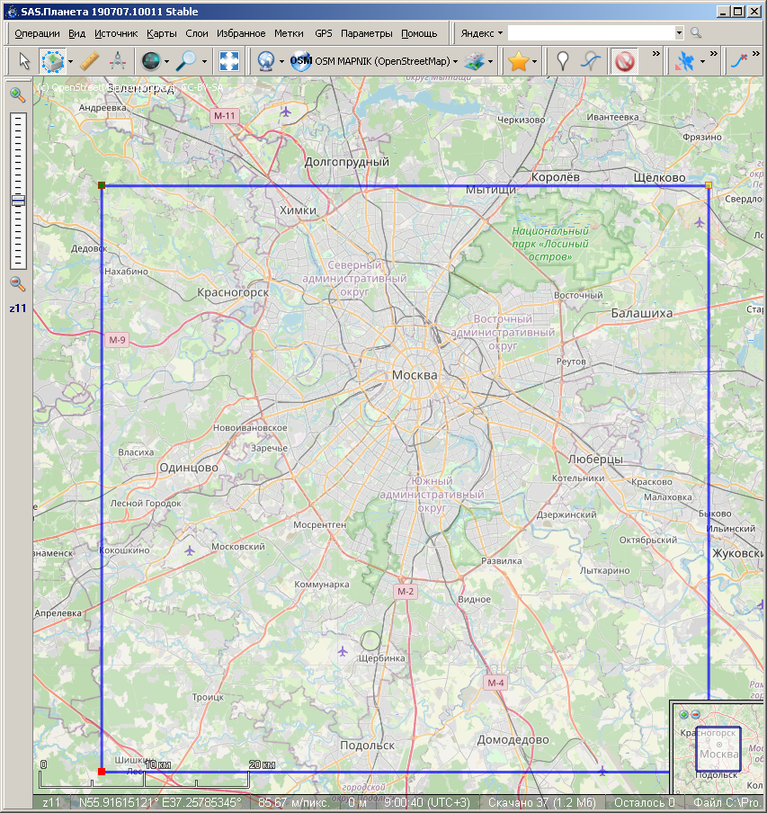
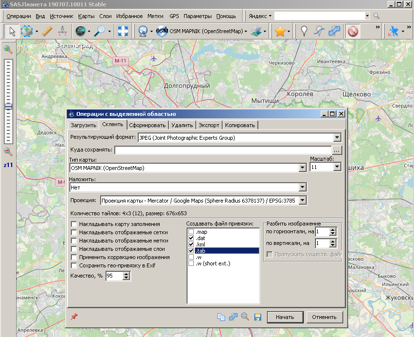
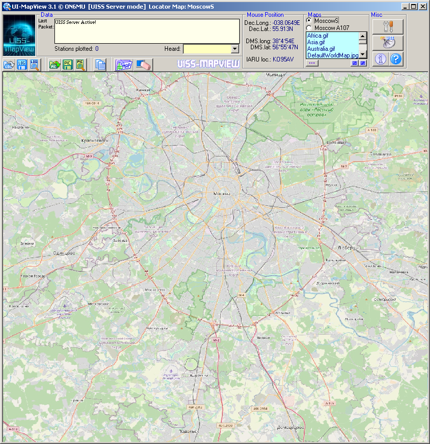
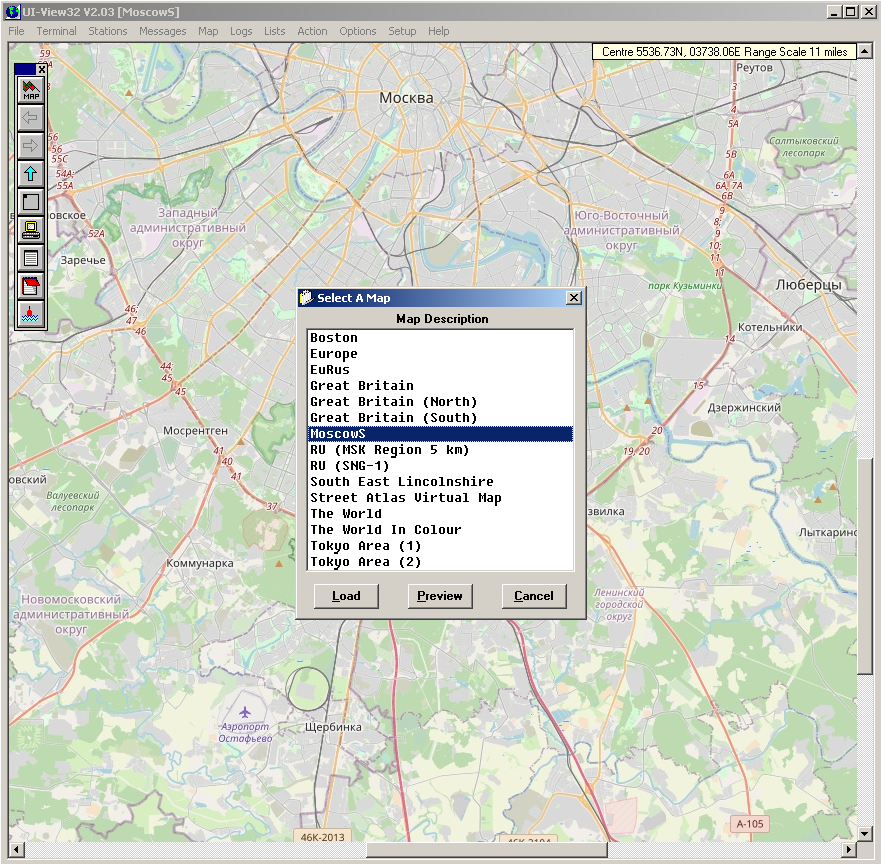

# From-SASPlanet-Mapping-2-UISS-MapView-Mapping

Create image map file from SASPlanet  (dat, tab, kml) to UISS map file (ini) and UIView map file (inf) console app

Это консольное приложение конвертирует файлы привязки карт .dat,    
.tab и .kml сформированные в SAS.Planet в .ini и .inf       
для UISS и UIView

